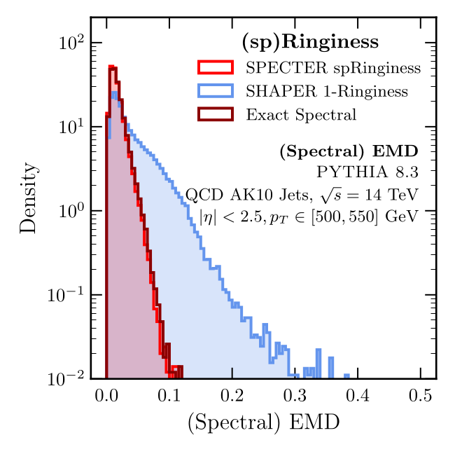

# SPECTER (v1.0.0)

[](https://github.com/rikab/SPECTER)

[](https://pypi.org/project/pyspecter/)
[](https://pypi.org/project/pyspecter/)


`SPECTER` is an implementation of the Spectral EMD (SEMD) and Spectral Shape Observables as outlined in ["SPECTER: fficient Evaluation of the Spectral EMD" (arxiv:2410.XXXXX)](https://arxiv.org/abs/2410.XXXXX). This package can be used for evaluating an extremely large class of IRC-safe observables, with modules in place to define custom observables and jet algorithms using an intuitive geometric language. Compared to ordinary EMD methods, this package is extremely fast, precise, and accurate. The SEMD is first defined in (arxiv:2305.03751)[https://arxiv.org/abs/2305.03751].




## Example Usage

Several end-to-end examples of how to use `SPECTER` can be found in the `examples` subfolder of this repository. This examples include computing pairwise SEMDs, computing spectral shape observables, and some basic image manipulation. 

The code used to perform all of the studies in ["SPECTER: fficient Evaluation of the Spectral EMD" (arxiv:2410.XXXXX)](https://arxiv.org/abs/2410.XXXXX) can be found in the `studies` subfolder.


## Installation

### From PyPI

In your Python environment run

```
python -m pip install specterpy
```

### From this repository locally

In your Python environment from the top level of this repository run:


```bash
pip install -.
```


## Dependencies

The primary dependencies are `jax` and `jaxlib`. 

To install jax and jaxlib, run the following commands:

```bash
pip install --upgrade pip
pip install --upgrade jax jaxlib==0.1.69+cuda111 -f https://storage.googleapis.com/jax-releases/jax_releases.html
```

Many of the examples and studies depend on the [ParticleLoader](https://github.com/rikab/ParticleLoader) package for downloading particle physics datasets. However, this package is not necessary for general usage of `SPECTER`

## Changelog

- v1.0.0: 8 October 2024. Official public release.

Based on the work in ["SPECTER: fficient Evaluation of the Spectral EMD" (arxiv:2410.XXXXX)](https://arxiv.org/abs/2410.XXXXX)

Bugs, Fixes, Ideas, or Questions? Contact me at rikab@mit.edu
